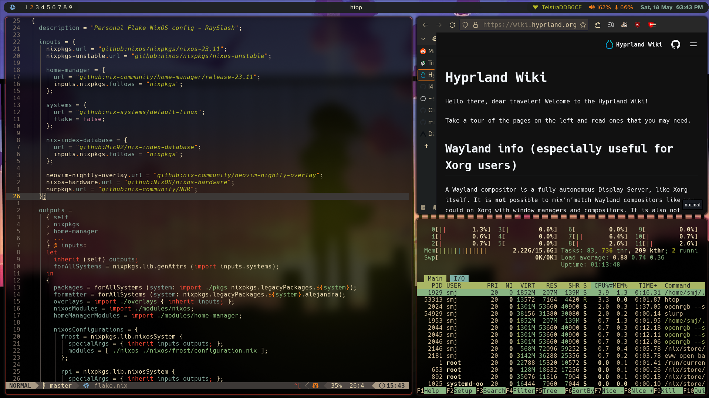

# NixOS + Home-Manager dotfiles

This repository consists of my personal NixOS configuration files. This is a flake repository. You know what to do!



## Hostnames

frost: x86_64

dell: x86_64

rpi: aarch64

iso: x86_64

## Usage

### ISO

To build the ISO image corresponding to `nixos/iso` configuration use:

```shell
nix build .#nixosConfigurations.live.config.system.build.isoImage
```

### New System Configuration

Partition and mount root, nix, boot and home using `fdisk` and `mount`. For each hostname, replace `host` with desired hostname:

```shell
sudo fdisk /dev/sdX                 #Recommended /, /boot and /nix partitions. Optionally, /home
sudo mount /dev/sdXX                #Mount all filesystems to /mnt
git clone https://github.com/RaySlash/nixos-config && cd nixos-config
rm */host/hardware-configuration.nix
sudo nixos-generate-config --root /mnt
sudo cp /etc/nixos/hardware-configuration.nix nixos/host/
sudo nixos-install --flake .#host
```

### Existing System Configuration

For each hostname, replace `host` with desired hostname:

```shell
git clone https://github.com/RaySlash/nixos-config && cd nixos-config
rm */host/hardware-configuration.nix
sudo cp /etc/nixos/hardware-configuration.nix nixos/host/
sudo nixos-rebuild boot --flake .#host
```

## Reference

[github:Misterio77/nix-starter-config](https://github.com/Misterio77/nix-starter-configs)

[Nixpkgs](https://github.com/NixOS/nixpkgs)

[NixOS Wiki](https://nixos.wiki/)

[NixOS and Flakes book](https://nixos-and-flakes.thiscute.world/nixos-with-flakes/introduction-to-flakes)

[Hyprland Wiki](https://wiki.hyprland.org/)
